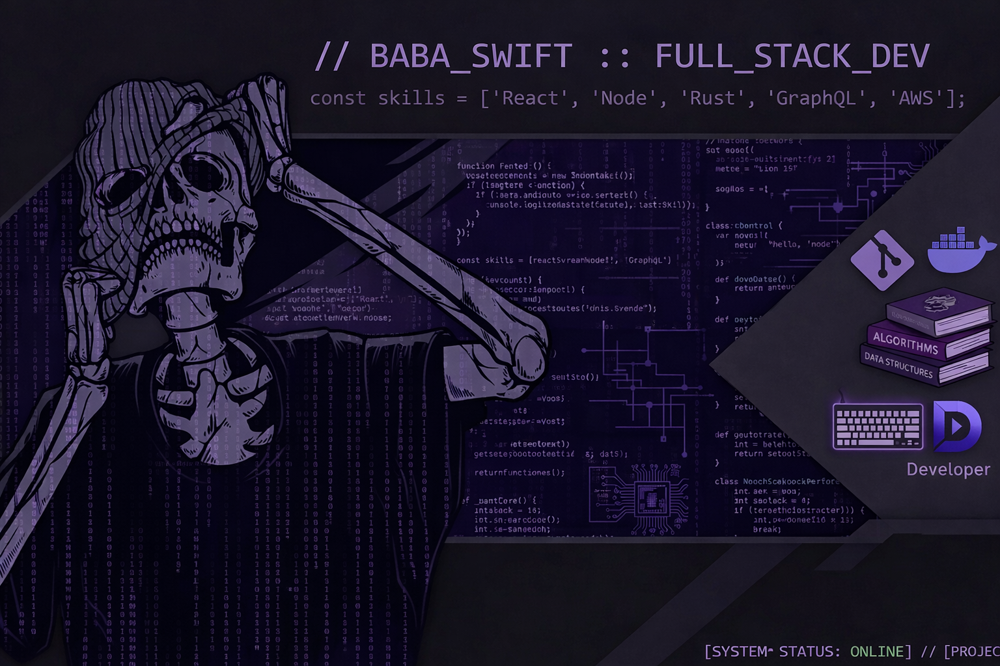

  

---

# Hi, I'm Baba Swift

### Full Stack Developer · Open Source Enthusiast

---

## About Me

- **Current focus:** Building real-world, production-ready applications
- **Learning:** Backend development, REST APIs, authentication & system design
- **Interested in:** Open source collaboration, freelance work, and internships
- **Ask me about:** Web development, MERN stack, and scalable app architecture
- **Fun fact:** I enjoy turning ideas into clean, maintainable code

---

## Tech Stack

<table align="center">
  <tr>
    <td align="center" width="96">
      
       HTML · CSS
    </td>
    <td align="center" width="96">
      
       JavaScript
    </td>
    <td align="center" width="96">
      
       Python
    </td>
    <td align="center" width="96">
      
       React
    </td>
    <td align="center" width="96">
      
       Node.js
    </td>
    <td align="center" width="96">
      
       MongoDB
    </td>
    <td align="center" width="96">
      
       Git & GitHub
    </td>
  </tr>
</table>

---

## GitHub Stats

---

## Currently Learning

- Backend development & REST API design
- Authentication (JWT, OAuth) & security best practices
- System design & scalable architecture

---

## Projects

| Project       | Description        | Stack   | Status        |
|--------------|--------------------|---------|---------------|
| Web App      | Full-stack web app | MERN    | Coming soon   |
| API          | RESTful API        | Node.js | Coming soon   |
| UI Library   | Reusable components| React   | Coming soon   |

*More projects and open-source contributions on the way.*

---

## Let's Connect

- **GitHub:** [@babaswift2005](https://github.com/babaswift2005)
- **LinkedIn:** [babaswift](https://www.linkedin.com/in/babaswift/)
- **Reddit:** [u/babaswift](https://www.reddit.com/user/babaswift/)
- **Telegram:** [@babaswiftz](https://t.me/babaswiftz) · Backup: [@babaswiftbot](https://t.me/babaswiftbot)
- **Open to:** Freelance work · Collaboration · Open source · Internship

---

**Thanks for visiting my profile.**

