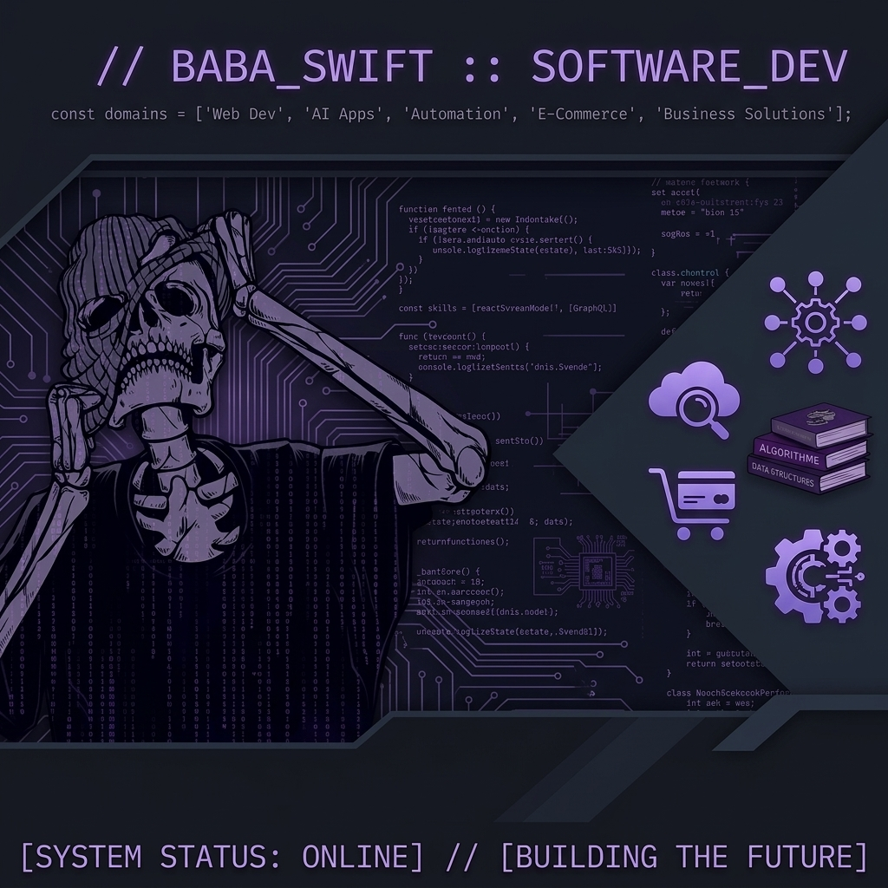

  

---

# Baba Swift

### Software Developer

**Web Development · AI Applications · Automation Systems · E-Commerce Platforms · Custom Business Solutions**

 

---

## About Me

Software Developer with hands-on experience building web applications, AI-powered tools, automation systems, and custom business solutions. I focus on writing clean, production-grade code and delivering software that solves real problems — from intelligent automation pipelines to scalable e-commerce platforms.

- **Currently working on:** AI-powered developer tools and automation platforms
- **Specialties:** Full-cycle product development, API architecture, AI/ML integration, and business process automation
- **Domains:** Web applications, AI applications, automation systems, e-commerce platforms, custom business solutions
- **Open to:** Freelance projects, contract work, consulting, and long-term collaborations

---

## Tech Stack

<table align="center">
  <tr>
    <th>Category</th>
    <th>Technologies</th>
  </tr>
  <tr>
    <td><strong>Languages</strong></td>
    <td>
      
       JavaScript · TypeScript · Python
    </td>
  </tr>
  <tr>
    <td><strong>Frontend</strong></td>
    <td>
      
       React · Next.js · HTML5 · CSS3 · Tailwind CSS
    </td>
  </tr>
  <tr>
    <td><strong>Backend</strong></td>
    <td>
      
       Node.js · Express · Flask · FastAPI
    </td>
  </tr>
  <tr>
    <td><strong>AI / ML</strong></td>
    <td>
      
       OpenAI API · LangChain · Ollama · Prompt Engineering
    </td>
  </tr>
  <tr>
    <td><strong>Databases</strong></td>
    <td>
      
       MongoDB · MySQL · PostgreSQL · Redis
    </td>
  </tr>
  <tr>
    <td><strong>DevOps & Tools</strong></td>
    <td>
      
       Git · GitHub · Docker · Linux · Nginx
    </td>
  </tr>
</table>

---

## Projects

| Project | Description | Stack | Links |
|---------|-------------|-------|-------|
| **RepoMind** | AI-powered tool that explains any GitHub repository using local LLMs via Ollama | TypeScript · Ollama | [View Repo](https://github.com/babaswift2005/repomind) |
| **Swift Recon** | Lightweight web reconnaissance tool — tech stack detection, endpoint discovery, and subdomain scanning | Python | [View Repo](https://github.com/babaswift2005/swift-recon) |
| **ResumeForge** | Resume builder application for generating professional resumes | JavaScript | [View Repo](https://github.com/babaswift2005/resumeforge) |
| **SwiftCommerce** | Full-featured e-commerce platform with payment integration, inventory management, and admin dashboard | Next.js · Stripe · MongoDB | [View Repo](https://github.com/babaswift2005/SwiftCommerce) |
| **AutoFlow AI** | Intelligent workflow automation engine with AI-powered decision making and task orchestration | Python · FastAPI · LangChain | In Progress |
| **NeuralAPI** | Production-ready REST API boilerplate with built-in AI features, authentication, and rate limiting | Express · OpenAI · Redis | Planned |
| **BotForge** | Multi-platform bot framework for Discord, Telegram, and Slack with plugin architecture | Node.js · Discord.js · Python | Planned |

---

## GitHub Stats

---

## Currently Learning

- **AI & LLMs** — Building agentic AI applications, RAG pipelines, and model fine-tuning
- **System Design** — Distributed systems, microservices, and event-driven architecture
- **Security** — OAuth 2.0, JWT, API hardening, and secure payment flows
- **DevOps** — CI/CD pipelines, containerization, and cloud deployment

---

## Contact

- **GitHub:** [@babaswift2005](https://github.com/babaswift2005)
- **LinkedIn:** [babaswift](https://www.linkedin.com/in/babaswift/)
- **Telegram:** [@babaswiftz](https://t.me/babaswiftz)

**Open to:** Freelance Projects · Contract Work · Collaboration · Consulting

---

*Building intelligent solutions, one commit at a time.*

